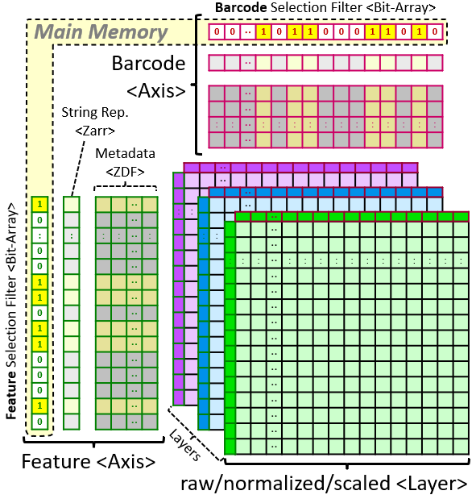

# SC-Elephant (Single-Cell Extremely Large Data Analysis Platform)
SC-Elephant is a python package for the analysis of extremely large single-cell data in a highly memory-efficient manner, with the support for simultaneous editing (collaborative analysis). 

<tt>SC-Elephant.py</tt> generates a <b><tt>RamData</tt></b> object for the analysis of a single-cell data matrix. The resulting <tt>RamData</tt> object, once uploaded to the GitHub Page (or any web location with <i>CORS</i> enabled), can be analyzed by <tt>SC-Elephant.py</tt> or <tt>.js</tt>. 

A <tt>RamData</tt> object is composed of two <b><tt>RamDataAxis</tt></b> (<b>Axis</b>) objects and multiple <b><tt>RamDataLayer</tt></b> (<b>Layer</b>) objects.

The two RamDataAxis objects, <b>'Barcode'</b> and <b>'Feature'</b> objects, use <b><tt>'filter'</tt></b> to select cells (barcodes) and genes (features) before retrieving data from the <tt>RamData</tt> object, respectively.

